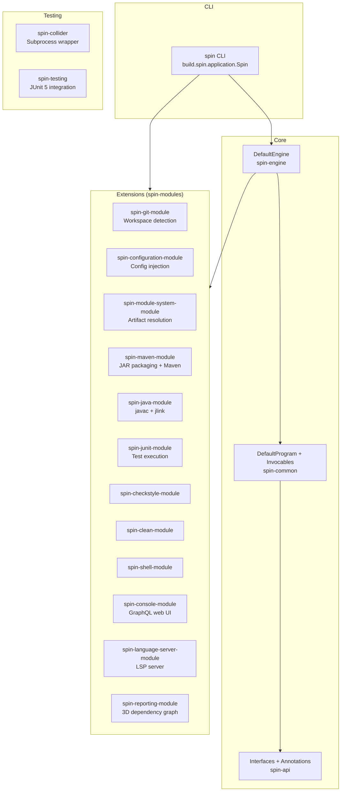
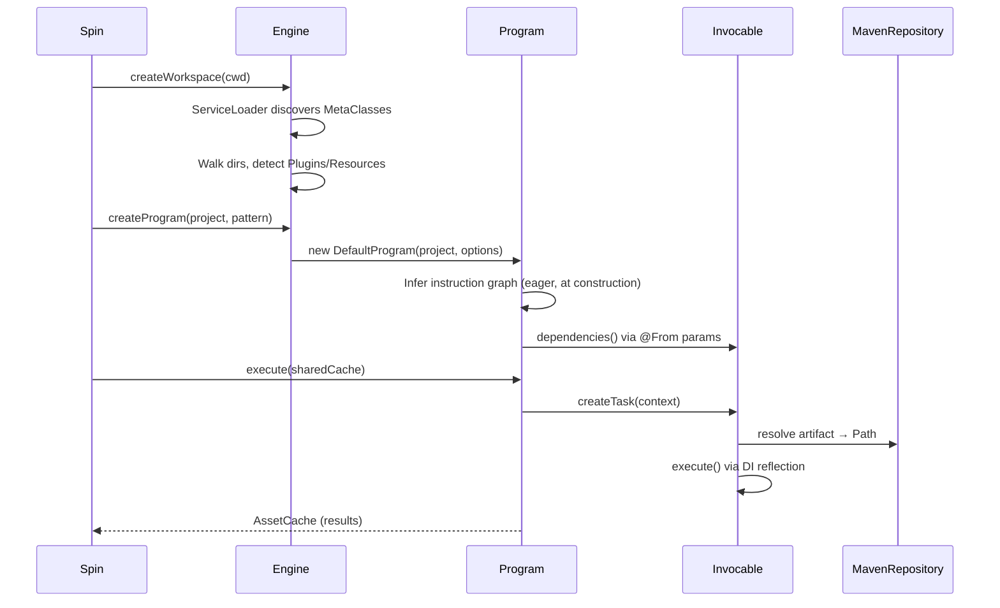
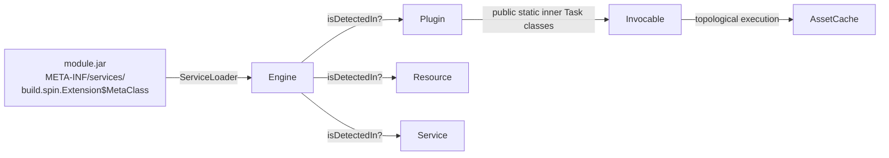

# Codebase Map

> Auto-generated by Cartographer. Last mapped: 2026-04-01

## System Overview

**spin** is a build system that *infers* what to do by inspecting a project's structure through pluggable Extensions, then executes a dependency-ordered graph (a `Program`) of `Task`s. Unlike traditional build systems, there are no build scripts — Extensions auto-detect what they apply to.



## Build Lifecycle

```
spin <task-name>         e.g.: spin clean package
```

1. **Bootstrap options parsed** — `-w` (working dir), `NetworkAccess`, `Verbose`, `ServerMode`, `ServerPort`
2. **DefaultEngine constructed** — `ServiceLoader<Extension.MetaClass>` discovers all registered extension metadata; `@Bootstrap` services (e.g., `ConfigurationService`) initialized first
3. **Workspace discovered** — engine walks up from CWD; a directory is a workspace root if `.git/`, `.spinignore`, or `module-catalog.properties` exists
4. **Project tree built** — DFS from workspace root; projects created wherever a `Plugin.MetaClass.isDetectedIn(path)` matches
5. **For each task name:**
   - `engine.createProgram(project, Task.Pattern)` → `DefaultProgram` immediately infers the full dependency graph (at construction time, not at execute time)
   - `program.execute(sharedCache)` → topological queue-based execution; tasks with no remaining dependencies dequeued and executed via DI reflection; results stored in `AssetCache`
   - Cacheable results promoted to the shared cross-program cache for reuse

## Directory Structure

```
spin.build/
├── pom.xml                      # Multi-module Maven aggregator + BOM
├── module-catalog.properties    # module-name → Maven GAV mappings
├── version.properties           # module-name glob → version mappings
├── coding-conventions.md        # Code style guide (Google Java Style, no nulls, etc.)
├── overview.md                  # Conceptual glossary
├── config/checkstyle/           # Checkstyle XML for enforcement
├── .mvn/wrapper/                # Maven Wrapper (pins Maven 3.9.14)
├── spin-api/                    # Public API: all interfaces + annotations
├── spin-common/                 # Default implementations of core interfaces
├── spin-engine/                 # Engine + Project implementations
├── spin/                        # CLI entry point + jlink packaging
├── spin-testing/                # JUnit 5 WorkspaceDiscovery extension
├── spin-collider/               # Subprocess launcher for integration tests
└── spin-modules/
    ├── spin-checkstyle-module/  # Checkstyle static analysis
    ├── spin-clean-module/       # Build directory lifecycle
    ├── spin-configuration-module/ # File-based config injection (@Configuration)
    ├── spin-console-module/     # GraphQL web console (Daemon)
    ├── spin-git-module/         # Git-based workspace root detection
    ├── spin-java-module/        # javac + javadoc + jlink (Java 8 and 25)
    ├── spin-java-module-tests/  # Integration tests for java module
    ├── spin-junit-module/       # JUnit 5 test execution
    ├── spin-language-server-module/ # LSP 3.18 server
    ├── spin-maven-module/       # Maven artifact resolution + JAR packaging
    ├── spin-module-system-module/ # ModuleDescriptor + ModuleCatalog + Artifact types
    ├── spin-reporting-module/   # 3D force-graph build report (auto, no-cache)
    └── spin-shell-module/       # Shell command execution
```

## Module Guide

### `spin-api` — The Public Contract

**Purpose:** All interfaces, annotations, and option types that Extensions depend on. Nothing else should be on the classpath of extension modules at compile time.

**Entry point:** `build.spin` Java module

**Key interfaces:**

| Interface | Purpose |
|---|---|
| `Engine` | Central facade — discovers workspaces, creates programs, manages services, DI context |
| `Extension` | Base marker for all extension types; inner `MetaClass` is ServiceLoader-discovered |
| `Plugin` | Extension that contributes `Task`s to a `Project`; `MetaClass.isDetectedIn(Path/Project)` |
| `Resource` | Project-scoped extension, injectable into Plugins/Tasks; `MetaClass.isWorkspace(Path)` |
| `Service` | Engine-wide singleton extension; `MetaClass.isDetectedIn(FileSystem)` |
| `Server` | Service + BackgroundProcessor; runs during `--server` mode |
| `Daemon` | Resource + BackgroundProcessor; project-specific server-mode background processor |
| `Task<T>` | Unit of work producing result `T`; executed via DI reflection on first public non-static method |
| `Invocable<T>` | Immutable descriptor: (Project, Plugin, TaskClass) triplet |
| `Reference` | Typed pointer to a Task within a Project; used as cache key |
| `Instruction<T>` | Enriched Invocable with dependency graph info (dependencies, dependents, codependencies) |
| `Program` | Executes a set of Instructions; returns an `AssetCache` |
| `Asset<T>` | Immutable result of a Task execution |
| `AssetCache` | Thread-safe store of `Asset`s keyed by `Reference` |
| `Project` | A directory with at least one detected Plugin/Resource |
| `Workspace` | Root Project (no parent); `AutoCloseable` |

**Key annotations:**

| Annotation | Purpose |
|---|---|
| `@From(Task.class)` | Inject another Task's result as a method parameter |
| `@After/@Before(Task.class)` | Declare execution ordering |
| `@Automatic` | Task always included in every Program |
| `@NoCache` | Task results never cached |
| `@Category("name")` | Group tasks for pattern matching |
| `@Bootstrap` | Service MetaClass initialized before project discovery |
| `@SpecifiedBy(Invocable.class)` | Override the Invocable class for a Task |
| `@PreProcess/@PostProcess` | (Infrastructure built, execution disabled in DefaultProgram) |

---

### `spin-common` — Default Implementations

**Purpose:** Concrete implementations of the core `spin-api` interfaces, including program inference and execution.

**Key files:**

| File | Purpose |
|---|---|
| `DefaultProgram` | Program inference (at construction) + topological execution |
| `DefaultInvocable` | Minimal Invocable — all logic in interface default methods |
| `DefaultInstruction` | Wires dependency graph; eagerly instantiates Task via DI |
| `NearAssetCache` | Two-level (front/back) cache for per-program vs. shared caching |
| `DefaultAssetCache` | `ConcurrentHashMap<Reference, Asset<?>>` |
| `FromResolver` | DI Resolver for `@From`-annotated task method parameters |
| `ProjectResourceResolver` | DI Resolver; walks project hierarchy to find Resources |
| `Invocables` | Static utilities: discovers `public static` inner Task classes via reflection |
| `DetectSourceFiles` | Common `Task<PathSet>` interface implemented by java/junit modules |

**Patterns:**
- `DefaultProgram` builds the instruction graph at construction time (eager)
- `@PreProcess`/`@PostProcess` codependency execution is commented out — infrastructure exists but is disabled
- No cycle detection (TODO in `DefaultProgram`) — cyclic dependencies will hang

---

### `spin-engine` — Engine Implementation

**Purpose:** `DefaultEngine` — discovers and instantiates all Extensions; creates Workspaces and Projects.

**Key files:**

| File | Purpose |
|---|---|
| `DefaultEngine` | ServiceLoader discovery; workspace/project tree construction; DI context hierarchy |
| `AbstractProject` | Base for `DefaultProject` and `DefaultWorkspace`; plugin/resource/invocable storage |
| `DefaultProject` / `DefaultWorkspace` | Concrete project implementations |
| `HeapBasedCache` | `ConcurrentHashMap` + `ReentrantLock` per key for atomic compute ops |

**Extension discovery order:**
1. `@Bootstrap` `Service.MetaClass`es (detected against `FileSystem`)
2. Non-Bootstrap `Service.MetaClass`es
3. All non-Service `MetaClass`es (`Plugin`, `Resource`, `Daemon`, `Server`)

**DI context hierarchy:** `Engine Context → MetaClass Context → Extension Context`

**Gotcha:** `Workspace.close()` has a bug — it calls the outer `close()` recursively instead of calling `closable.close()` on each AutoCloseable plugin.

---

### `spin` — CLI Entry Point

**Purpose:** `Spin.main()` — parses CLI args, creates the Engine, runs Programs.

**Main class:** `build.spin.application.Spin`

**Execution flow:**
1. Print ASCII banner to stderr
2. Parse bootstrap options; create `DefaultEngine`
3. `engine.createWorkspace(path)` → walk up to find workspace root; DFS down for projects
4. **Server mode:** Collect all `BackgroundProcessor`s; start; block until first exits
5. **Normal mode:** For each task name, `createProgram()` then `execute(sharedCache)`; promote cacheable results to shared cache

**Gotcha:** Spin builds itself — `spin` module's Maven build invokes `Spin.main("clean", "jlink")` during `prepare-package`.

---

### `spin-testing` — JUnit 5 Integration

**Purpose:** `WorkspaceDiscovery` JUnit 5 extension for writing integration tests against real workspaces.

```java
@ExtendWith(WorkspaceDiscovery.class)
class MyTest {
    @Test
    @WorkspacePath("my-test-workspace")
    void test(Workspace workspace, Engine engine) { ... }
}
```

**Key annotations:** `@WorkspacePath("path")`, `@RequireJavaVersion("17")`

**Behavior:** Creates a fresh `DefaultEngine` per test method; injects `Workspace`, `Engine`, or anything from the Engine's DI context.

---

### `spin-collider` — Subprocess Launcher

**Purpose:** Launches `Spin` as a separate JVM process; waits for its server port to be ready. Used by integration tests requiring a running spin server.

**Pattern:** `SpinApplication.Customizer` (pre-launch config) + `SpinApplication.Implementation` (post-start readiness check via TCP probe).

---

## Spin Modules

### `spin-git-module`

**Registered:** `GitResource$MetaClass`

**Purpose:** Detects `.git/` directory → marks path as workspace root. Pure detection, no tasks.

**Gotcha:** `isDetectedIn(Project)` always returns `false` — only workspace root detection, never a per-project resource.

---

### `spin-configuration-module`

**Registered:** `ConfigurationService$MetaClass` (@Bootstrap Service), `ConfigurationResource$MetaClass` (Resource)

**Purpose:** File-based config injection. Extensions can declare `@Configuration @Source("name") MyConfig cfg` fields; spin resolves from `.spin/<ClassName>.json` or `.spin/<ClassName>.properties` searching from project up to workspace.

**Workspace detection:** `isWorkspace(Path)` returns `true` when `.spinignore` exists.

**Key types:** `@Configuration`, `@Source`, `Hierarchical<T>` (child-first config hierarchy)

**Gotcha:** `ConfigurationResource` also processes `.spinignore` (glob patterns) to mark ignored paths.

---

### `spin-module-system-module`

**Registered:** `ProjectModuleCatalog$MetaClass` (Resource), `ProjectModuleVersioning$MetaClass` (Resource)

**Purpose:** Core module identity abstraction used by almost all other modules.

**Key types:**

| Type | Purpose |
|---|---|
| `Artifact` | Maven GAV coordinates |
| `ModuleDescriptor` | Java module info — parsed from source, bytecode, or synthesized |
| `ModuleCatalog` | Maps Java module names → Maven GAV; loaded from `module-catalog.properties` |
| `ModuleVersioning` | Maps module name globs → versions; loaded from `version.properties` |
| `Artifact.Resolver` | Resolves module name → JAR path |

**Workspace detection:** `isWorkspace(Path)` returns `true` when `module-catalog.properties` exists.

---

### `spin-clean-module`

**Registered:** `CleanPlugin$MetaClass`

**Tasks:**
- `clean` — recursively deletes the build directory
- `create.build.path` — creates the build directory (used as `@From` prerequisite by all output-producing tasks)

**Always active:** `isDetectedIn(Project)` always returns `true`.

**Gotcha:** `CleanPlugin.delete(Path)` is a static utility used by other modules (java, maven).

---

### `spin-maven-module`

**Registered:** `MavenPlugin$MetaClass` (Plugin), `MavenRepository$MetaClass` (Service)

**Purpose:** Maven artifact resolution (Eclipse Aether) + JAR/sources/javadoc packaging + POM generation.

**Tasks:**

| Task | Purpose |
|---|---|
| `package.module` | Build JAR; implements `PackageModule` interface |
| `package.source` | Build `-sources.jar` |
| `package.javadoc` | Build `-javadoc.jar` |
| `create.pom` | Generate `pom.xml` from `module-info.java` requires |
| `create.module.manifest` | Build `MANIFEST.MF` (`Automatic-Module-Name`, `Multi-Release: true`) |

**Resolution:** `MavenRepository` uses Eclipse Aether; reads `~/.m2/settings.xml`; falls back to Maven Central. Detected when `~/.m2/` exists.

**Gotchas:**
- `MavenPlugin.MetaClass.isDetectedIn(Path)` always returns `false` — only activates when a `JavaCompilerPlugin` is present in the project
- `MavenRepository.getModuleDescriptor()`: tries extracting `module-info.class`; falls back to POM `<dependency>` parsing
- `provided` scope Maven deps → `requires static` (optional); `compile`/`runtime` → `requires transitive`

---

### `spin-java-module`

**Registered:** `JavaPlatform$MetaClass` (Service), `CustomizationPlugin$MetaClass`, `Java8CompilerPlugin$MetaClass`, `Java25CompilerPlugin$MetaClass`, `ResourcePlugin$MetaClass`

**Purpose:** Core Java compilation — `javac`, `javadoc`, `jdeps`, `jlink`, multi-release JARs, `Build.java` custom tasks.

**Key interfaces:** `JavaPlugin`, `JavaCompilerPlugin`, `PackageModule` (result: `ArtifactDescriptor`)

**Detection:** `Java8CompilerPlugin` detects `src/main/java` (when system JDK=8) or `src/main/java8`. Same pattern for Java 25.

**Tasks:**

| Task | Purpose |
|---|---|
| `compile` | Run `javac`; wires cross-project deps from `module-info.java requires` |
| `javadoc` | Run `javadoc` (only for system JDK version) |
| `jdeps` | Run `jdeps --list-deps` on packaged JAR |
| `jlink` | Run `jlink` to produce custom JRE; generates launcher script via FreeMarker |
| `detect.source.files` | Walk `src/main/java[N]` for `.java` files |
| `detect.compilation.classpath` | Resolve classpath from `module-info.java requires` |
| `copy.module.resources` | Copy `src/main/resources` |

**`JavaPlatform` Service:** Discovers installed JDKs via `JDKDetector`; provides `getVersion(int major)`, `getEarliest()`, `getLatest()`.

**Gotchas:**
- Both `Java8CompilerPlugin` and `Java25CompilerPlugin` can activate simultaneously for multi-release projects
- Cross-project `requires` in `module-info.java` automatically wire `Compile` task prerequisites for workspace-internal modules
- `CustomizationPlugin` compiles `Build.java` and loads custom Task classes dynamically via `URLClassLoader`
- `jdeps` has a hard-coded exclusion list: `commons.logging`, `slf4j.api`, `jboss.logmanager`, `j2objc.annotations`, `failureaccess`, `org.graalvm.*`

---

### `spin-junit-module`

**Registered:** `Java8JUnitPlugin$MetaClass`, `Java25JUnitPlugin$MetaClass`, `ResourcePlugin$MetaClass`

**Purpose:** Compile and run JUnit 5 tests via JUnit Platform Console Launcher.

**Detects:** `src/test/java[N]` directories.

**Tasks:** `test-compile`, `test`, `detect.test.source.files`, `detect.test.compilation.classpath`, `copy.junit.resources`

**Gotcha:** Merges test module descriptor with the paired `JavaCompilerPlugin`'s descriptor; for multi-release tests, manually adds `META-INF/versions/<N>` to classpath.

---

### `spin-checkstyle-module`

**Registered:** `CheckstylePlugin$MetaClass`

**Purpose:** Run Checkstyle static analysis after Java compilation.

**Detects:** Project has `JavaCompilerPlugin` AND workspace has `checkstyle/checkstyle.xml`.

**Tasks:** `checkstyle` (`@After(JavaCompilerPlugin.Compile.class)`)

**Hard-coded deps:** `com.puppycrawl.tools:checkstyle:8.8`, `com.workday:checkstyle-checks:4.0.13`

---

### `spin-console-module`

**Registered:** `WorkspaceConsole$MetaClass` (Daemon)

**Purpose:** GraphQL-over-HTTP web console for the workspace; runs in `--server` mode on port 8080. Only activates on the workspace root project.

**Status:** Placeholder `schema.graphqls` with a stub `hello: String` query.

---

### `spin-language-server-module`

**Registered:** `LanguageServer$MetaClass` (Server)

**Purpose:** LSP 3.18 server (TCP + stdin/stdout). Dispatches to `ProtocolHandler`s keyed by file extension. Always active.

**Advertised capabilities:** Completion, sync, diagnostics, document/workspace symbols, references, definition.

**Gotcha:** Busy-wait loop (`while (input.available() == 0) {}`) on idle stdin connections — can cause 100% CPU usage.

---

### `spin-reporting-module`

**Registered:** `ReportingPlugin$MetaClass`

**Purpose:** Auto-generates an interactive 3D force-directed graph of the build's task dependency graph as HTML. `@Automatic @NoCache` — runs for every build, never cached. Always active for every project.

**Output:** `<build-dir>/<pattern>-report.html` using the `3d-force-graph` CDN library.

---

## Data Flow

### Dependency Resolution Flow



### Extension Registration



## Conventions

- **Google Java Style** — enforced by Checkstyle
- **No nulls** — use `Optional`, `Stream`; NPEs are bugs
- **No logging** — use `TelemetryRecorder` with URI-addressed events; nothing to stderr from extensions
- **No static state** — except constants
- **Functional-style getters** — `age()` not `getAge()`; `Stream` returns do NOT use `get` prefix
- **Naming** — no `I` prefix on interfaces, no `Impl` suffix; `Default` for default impls, `Abstract` for abstract bases
- **DI everywhere** — use `build.codemodel.injection` (Jakarta Inject compatible); constructors are private or package-private; use Builder or static factory

## Gotchas

1. **`@PreProcess`/`@PostProcess` execution is disabled** — the infrastructure (MetaClass discovery, `Instruction.codependencies()`) is fully built but the actual invocation is commented out in `DefaultProgram.execute()`
2. **No cycle detection** — a `TODO` exists; cyclic task dependencies will likely hang or stack-overflow
3. **`Workspace.close()` bug** — calls `close()` instead of `closable.close()`, calling itself recursively
4. **`Reference.equals()` uses project name string** (not object identity) — two `Project` objects with the same name are considered identical in dependency graphs
5. **Java 25 target with MR JAR structure** — `module-info.java` under `META-INF/versions/17/` for Java 17 MR compatibility; source compiled to Java 25
6. **`version.properties` not yet used** — comment says "coming soon"
7. **Task discovery via reflection** — Tasks must be `public static` non-abstract inner classes of their Plugin; non-public or non-static inner classes are silently ignored
8. **`LanguageServer` busy-wait** — `while (input.available() == 0) {}` on idle stdin = 100% CPU

## Navigation Guide

**To add a new CLI task to an existing Plugin:**
- Add a `public static` inner class implementing `Task<T>` inside the Plugin class
- Annotate with `@Named("task-name")`, `@Category("...")`, `@After(...)` as needed
- Inject prerequisites with `@From(OtherTask.class) OtherResult result` in the execute method

**To create a new Plugin module:**
- Create a `Plugin` impl with inner `MetaClass implements Plugin.MetaClass`
- Implement `isDetectedIn(Path)` and/or `isDetectedIn(Project)` for auto-detection
- Add `META-INF/services/build.spin.Extension$MetaClass` listing your MetaClass
- Add a `pom.xml` and register the module in the root `pom.xml`

**To create a new workspace-level Service:**
- Implement `Service` + nested `MetaClass implements Service.MetaClass`
- `isDetectedIn(FileSystem)` returns true when the service should activate

**To add file-based configuration to an Extension:**
- Add `@Configuration @Source("filename") Optional<MyConfig> config` field
- Place config at `.spin/filename.json` or `.spin/filename.properties` in the workspace

**To write integration tests:**
- Use `@ExtendWith(WorkspaceDiscovery.class)` from `spin-testing`
- Add `@WorkspacePath("workspace-name")` to test methods
- Inject `Workspace`, `Engine`, or any DI-resolved type as parameters
- Place test workspaces in `src/test/resources/workspaces/`

**To modify artifact resolution:**
- See `MavenRepository` in `spin-maven-module` — primary resolver
- Module name → artifact mapping: edit `module-catalog.properties`
- Version pinning: edit `version.properties`
