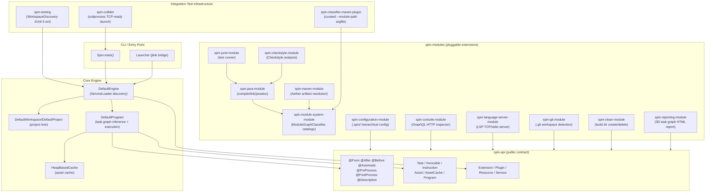
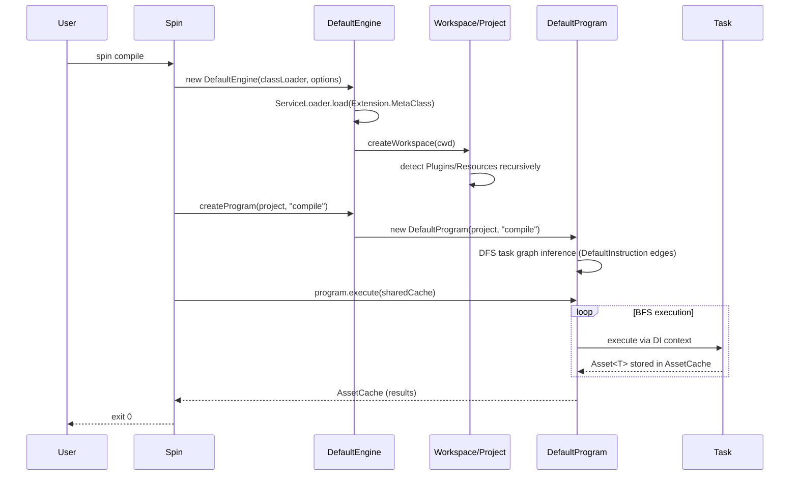
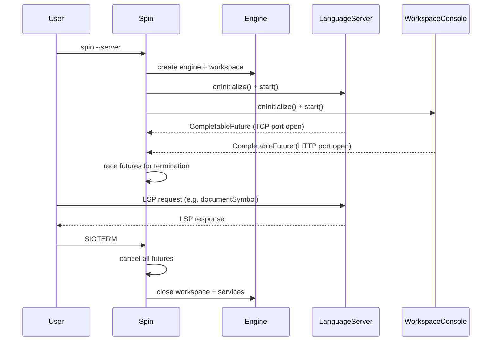

# Codebase Map

> Auto-generated by Cartographer. Last mapped: 2026-04-21

## System Overview

**spin** is a script-free Java 25 build system. It infers what to build by inspecting project structure via pluggable `Extension`s discovered through JPMS `ServiceLoader`. Extensions auto-detect applicability, declare task dependencies via annotations (`@From`, `@After`, `@Before`), and are composed via a DI framework (`build.codemodel.dependency.injection`). No build scripts are required.



---

## Directory Structure

```
spin.build/
├── spin-api/                  Public contract — all interfaces, annotations, option types
├── spin-common/               Core implementations — DefaultProgram, DefaultInvocable, DI resolvers, utilities
├── spin-engine/               Engine — ServiceLoader discovery, workspace/project tree, HeapBasedCache
├── spin/                      CLI entry point (Spin.main), Launcher bridge, jlink packaging, self-hosting build
├── spin-modules/
│   ├── spin-java-module/          Java compilation, linking (jlink), javadoc, multi-version JARs
│   ├── spin-module-system-module/ ModuleGraphClassifier, ModuleCatalog, ArtifactDescriptor, versioning
│   ├── spin-maven-module/         Eclipse Aether artifact resolution, Maven packaging (JAR/POM/sources/javadoc)
│   ├── spin-junit-module/         JUnit 5/6 test runner (Java 8 and Java 25 variants)
│   ├── spin-configuration-module/ .spin/ hierarchical config, .spinignore workspace detection
│   ├── spin-console-module/       GraphQL HTTP console for workspace introspection
│   ├── spin-language-server-module/ LSP server (TCP/stdio)
│   ├── spin-checkstyle-module/    Checkstyle code style enforcement
│   ├── spin-clean-module/         Build directory create/delete
│   ├── spin-git-module/           Git workspace root detection
│   ├── spin-reporting-module/     3D force-directed HTML task graph report
│   ├── spin-engine-tests/         Engine integration tests (cyclic deps, pre/post processing)
│   └── spin-java-module-tests/    Java module integration tests
├── spin-testing/              WorkspaceDiscovery JUnit 5 extension for integration tests
├── spin-collider/             Subprocess launcher for tests requiring a running spin server
├── spin-classifier-maven-plugin/ Maven plugin — curated --module-path / --class-path argfile for JPMS
├── docs/                      CODEBASE_MAP.md, ROADMAP.md
├── config/                    Checkstyle XML, IntelliJ code style
├── pom.xml                    Root multi-module POM (Java 25, Maven 3.9)
├── module-catalog.properties  Module-name → Maven coordinates mapping
├── version.properties         Module-name glob → version mapping
├── coding-conventions.md      Google Java Style + spin-specific rules
└── install-dev.sh             Developer install script (~/.spin symlink)
```

---

## Module Guide

### `spin-api` — Public Contract

**JPMS module:** `build.spin`
**Purpose:** Every interface, annotation, and option type that extension authors need. No implementation classes. Transitively re-exports `build.codemodel.dependency.injection`, `build.base.*`, and `jakarta.inject`.

**Key interfaces:**

| Interface | Scope | Purpose |
|---|---|---|
| `Extension` | — | Base marker; nested `MetaClass` provides runtime type info, scheme URI, CLI option classes |
| `Service` | Workspace-global | Detected once against `FileSystem`; injectable everywhere |
| `Server` | Workspace-global | `Service` + `BackgroundProcessor`; lifecycle managed by server mode |
| `Resource` | Project-scoped | Detected per project; flows down to children; can mark ignored paths and workspace roots |
| `Daemon` | Project-scoped | `Resource` + `BackgroundProcessor`; background async work per project |
| `Plugin` | Project-scoped | Declares `Task`s via `public static` inner classes |
| `Task<T>` | — | Unit of work producing `Asset<T>`; must be a `public static` inner class of a `Plugin` |
| `Invocable<T>` | — | Project-specific metadata for a `Task` class; computes `URI`, resolves `@From` dependencies |
| `Instruction<T>` | — | Fully-wired node in a `Program`: `Invocable` + dependency/dependent/codependency references |
| `Program` | — | Ordered set of `Instruction`s ready to execute; returns an `AssetCache` |
| `Engine` | — | Central facility: extension discovery, workspace creation, `Program` inference |
| `Project` | — | A path with detected `Plugin`s and `Resource`s; forms a parent–child hierarchy |
| `Workspace` | — | Root `Project` (no parent); also `AutoCloseable` |
| `Asset<T>` | — | Immutable result of a `Task` execution; keyed by `Invocable` reference |
| `AssetCache` | — | Store of `Asset`s keyed by `Reference`; supports cross-program caching |
| `Reference` | — | Immutable value type identifying `(Project, Task class)`; used as cache keys and dependency lists |
| `Cache<K,V>` | — | Thread-safe, null-free `Map` with expiry and functional updates |

**Annotation taxonomy:**

| Annotation | Target | Semantics |
|---|---|---|
| `@From(Task.class)` | `PARAMETER` | Data dependency: named task must run first; result injected into this parameter. Abstract/interface targets require `Stream<T>` parameter. |
| `@After(Task.class)` | `TYPE`, `METHOD` | Ordering only: this task runs after the named task. Result is NOT injected. |
| `@Before(Task.class)` | `TYPE`, `METHOD` | Inverse of `@After`. |
| `@PreProcess(Task.class)` | `TYPE`, `METHOD` | Codependency: always runs before the named task; result is private to that relationship. |
| `@PostProcess(Task.class)` | `TYPE`, `METHOD` | Codependency: always runs after the named task. |
| `@Automatic` | `TYPE` | Task is included in every program, even if not requested by name. |
| `@Bootstrap` | `TYPE` | Applied to `Service.MetaClass`; instantiated before non-bootstrap services. |
| `@Category(String)` | `TYPE` (repeatable) | Groups tasks under a named category; task included when program matches that category. |
| `@Description(String)` | `TYPE` | Human-readable task description shown in CLI help output and tooling. |
| `@NoCache` | `TYPE` | Disables cross-program result caching for this task. |
| `@SpecifiedBy(Invocable.class)` | `TYPE` | Overrides which `Invocable` implementation class wraps this task. |
| `@System` | `FIELD`, `PARAMETER`, `METHOD` | Jakarta `@Qualifier`; requests the system-detected (not user-overridden) value. |

**Option types** (`build.spin.option`): `BuildDirectoryName` (`.build`), `TargetDirectoryName` (`target`), `EngineVersion` (auto-detects from jar manifest), `NetworkAccess` (`ONLINE`/`OFFLINE`), `OperatingSystem` (auto-detects), `ServerMode` (`ENABLED`/`DISABLED`), `ServerPort` (`8686`), `Verbose` (`ENABLED`/`DISABLED`).

---

### `spin-common` — Implementation Utilities

**JPMS module:** `build.spin.common`
**Purpose:** All concrete implementations used by the engine and extensions — program inference/execution, asset caching, DI resolvers, task base classes, and utilities.

**Key files:**

| File | Purpose |
|---|---|
| `DefaultProgram` | Infers the task graph from a `Task.Pattern`, executes it BFS-style. The heart of spin. |
| `DefaultInvocable<T>` | Standard `Invocable` implementation. URI: `task:<project-path>/<task-name>`. |
| `DefaultInstruction<T>` | Builds dependency/dependent/codependency edges from `@From`, `@After`, `@Before`, `@PreProcess`, `@PostProcess`. |
| `DefaultAsset<T>` | Immutable asset wrapper; enforces non-null values. |
| `VoidAsset` | Sentinel asset for void-returning tasks; `get()` throws. |
| `DefaultAssetCache` | `ConcurrentHashMap`-backed `AssetCache`. |
| `NearAssetCache` | Two-level (front/back) read-through cache; front = this program, back = prior programs. |
| `FromResolver` | DI resolver for `@From`-annotated parameters; looks up `AssetCache` during execution. |
| `ProjectResourceResolver` | DI resolver that walks the project hierarchy to inject `Resource` instances. |
| `@Ordered` | Meta-annotation enabling sequential execution of same-task multiple-version plugins. |
| `TelemetryPublisher` | `TelemetryRecorder` implementation; routes to `Consumer<Telemetry>`. |
| `Invocables` | Static factory: task discovery (reflects on plugin inner classes), URI construction. |
| `Globs` | Converts POSIX glob patterns to `java.util.regex.Pattern`. |
| `TextualPositions` | Formats `TextualPosition`/`TextualRange` for compiler and LSP diagnostics. |
| `AbstractCopy` | Base `Task<PathSet>` providing recursive file copy helpers. |
| `DetectSourceFiles` / `DetectSourcePaths` | Task interfaces for source discovery. |

**`DefaultProgram` — inference phase:**
1. Walk project tree for `Invocable`s matching the `Task.Pattern`.
2. DFS over the dependency graph (via `DefaultInstruction` edge collection).
3. Add `@Automatic` tasks that aren't already included.
4. Wire back-edges (dependent → dependents).

**`DefaultProgram` — execution phase:**
1. Create a `NearAssetCache` (front = local, back = prior programs).
2. BFS: queue all zero-dependency instructions first.
3. Per instruction: run `@PreProcess` codependencies → execute task → run `@PostProcess` codependencies → store `DefaultAsset` or `VoidAsset`.
4. Newly-unblocked dependents are queued after each task completes.
5. Remaining unexecuted instructions after queue drains → `ProgramExecutionException` (cyclic or unsatisfied).

**DI resolver chain per task (innermost to outermost):**
1. `FromResolver` (handles `@From`-annotated parameters via `AssetCache`)
2. Plugin's `ProvidesResolver`, `Iterable<Plugin>` resolver, `Stream<Instruction>` resolver
3. Direct bindings: `Workspace`, `Project`, `Path`, plugin interfaces, `TelemetryRecorder`
4. `ProjectResourceResolver` (searches hierarchy for `Resource`)
5. Resource-as-`Resolver` chain
6. Engine context resolver (for `Service` injection)
7. `ConfigurationResolver`, `DefaultOptionResolver`

---

### `spin-engine` — Engine Core

**JPMS module:** `build.spin.engine`
**Purpose:** `ServiceLoader`-based extension discovery, workspace/project tree construction, and `HeapBasedCache`.

**Key files:**

| File | Purpose |
|---|---|
| `DefaultEngine` | Discovers extensions via `ServiceLoader<Extension.MetaClass>`, builds DI contexts, creates workspace/project tree recursively, creates `Program`s. |
| `DefaultWorkspace` | Root project node (no parent); thin subclass of `AbstractProject`. |
| `DefaultProject` | Non-root project node; thin subclass of `AbstractProject`. |
| `AbstractProject` | All project state and logic: plugins/resources/invocables maps, tree walk, `isIgnored`, codependency lookup. |
| `HeapBasedCache` | Thread-safe `Cache<K,V>` backed by `ConcurrentHashMap` with per-key `ReentrantLock` and a stable-lock retry loop. |

**Extension discovery (three ServiceLoader passes):**
1. `@Bootstrap` `Service.MetaClass` providers — created, detected against filesystem, instantiated.
2. Non-`@Bootstrap` `Service.MetaClass` providers — same pipeline.
3. All other `Extension.MetaClass` providers — only `createExtensionMetaClass` called (no instance created).

**DI context hierarchy:**
```
Engine root Context
  └── MetaClass Context (per Extension.MetaClass type)
       └── Extension Context (per Extension instance)
            └── Project Context (per discovered project)
```

**Project tree construction** (`createProject`): Depth-first traversal. For each directory: check `Resource.MetaClass.isWorkspace` / `Plugin.MetaClass.isDetectedIn(path)` to decide if a project node is created, then recurse into children. `AbstractProject`'s `plugins`, `resources`, `invocables` maps are populated directly by the engine (friend-class pattern within the same package).

**`HeapBasedCache` gotcha:** `clear()` materializes `keys().toList()` before iterating — avoids skipping entries during concurrent modification of the underlying `ConcurrentHashMap`.

---

### `spin` — CLI Entry Point

**JPMS module:** `build.spin.application`
**Purpose:** `Spin.main()` entry point + `Launcher` (Maven exec bridge for self-hosting). Packages into a jlink runtime image.

**`Spin.main()` phases:**
1. `--version` → print version and exit.
2. Print ASCII banner.
3. Parse bootstrap options (working dir, network access, verbose, server mode, port).
4. Create `DefaultEngine` with shared `CommandLineParser` (extensions register their own option classes).
5. `engine.createWorkspace(path)` + `workspace.getProject(cwd)`.
6. Print workspace tree + available task names (with `@Description` text if present).
7. **Server mode**: collect `BackgroundProcessor` instances (services + daemon resources), call `onInitialize()` then `start()`, race all `CompletableFuture`s to termination, then close.
8. **One-shot mode**: re-parse args to extract task names, create program per task, chain executions with a shared `AssetCache` for caching.

**`Launcher`** (Maven exec bridge):
- `exec-maven-plugin` produces a flat classpath; split packages (Maven Resolver, Maven Core) break JPMS.
- `Launcher` reads `java.class.path`, unwraps any pathing-jar, calls `ModuleGraphClassifier.classifyAndResolve`, then re-execs `java -m build.spin.application/...Spin` with correct `--module-path` + `-cp`.
- Also forwards all JVM input arguments from `ManagementFactory.getRuntimeMXBean().getInputArguments()`.

**Self-hosting build** (`spin/pom.xml`, `prepare-package` phase):
1. `spin1-build-spin2`: Maven (spin₁) → `Launcher` → modular spin → `clean jlink` → spin₂ in `.build/spin-<os>-<arch>/` (host's own target)
2. `spin2-build-spin3`: spin₂ → `clean jlink` → spin₃ in `.build/spin-<os>-<arch>/`; launcher script + module-set diffed for structural equivalence.

**Module `requires` note:** `spin/module-info.java` declares `requires transitive build.spin.testing` so that `spin-collider` (which does `requires transitive build.spin.application`) gets the testing framework transitively.

---

### `spin-testing` — Integration Test Harness

**JPMS module:** `build.spin.testing`
**Purpose:** JUnit 5 extension infrastructure for workspace-based integration tests.

**Key classes:**

| Class | Purpose |
|---|---|
| `WorkspaceDiscovery` | JUnit 5 extension implementing `BeforeAll/BeforeEach/AfterEach/ParameterResolver`. Manages per-test workspace lifecycle. |
| `@WorkspacePath("name")` | Method annotation; selects which workspace fixture under `src/test/resources/workspaces/` to use. |
| `@RequireJavaVersion("25")` | Method annotation; overrides `JDKVersion` used for the test engine. |

**`WorkspaceDiscovery` behavior:**
- `beforeAll`: resolves `projectsRootPath = test-class-codesource/workspaces/`.
- `beforeEach`: reads `@WorkspacePath`, determines `JDKVersion` (annotation > path-suffix digits > current), creates `DefaultEngine` + workspace.
- `afterEach`: closes the workspace.
- `resolveParameter`: injects `Workspace`, `Engine`, or any type resolvable from `engine.context()`.

**Workspace fixture layout convention:**
```
src/test/resources/workspaces/
    my-workspace-25/        ← name ends in digits → JDKVersion 25
    my-workspace-8/         ← JDKVersion 8
    my-workspace/           ← uses @RequireJavaVersion or current JDK
```

---

### `spin-collider` — Server Integration Tests

**JPMS module:** `build.spin.collider`
**Purpose:** Launches spin as a real subprocess and verifies TCP-level server interaction.

**`SpinApplication`** (extends `JDKApplication`):
- `Customizer`: sets `MainClass.of(Spin.class)` and `JDK.current().home()`.
- `Implementation.onStart()`: waits for `Network.connect(localhost:ServerPort.DEFAULT, 100ms)` before resolving the `CompletableFuture<SpinApplication>`, ensuring tests only run when the server is actually accepting connections.

**`SpinApplicationTests`** verifies: start spin with `--server`, open a raw `Socket`, send a JSON-RPC `textDocument/documentSymbol` request with LSP `Content-Length` framing, assert response contains `"Content-Length"`.

**JPMS build wiring:** `spin-collider/pom.xml` uses `spin-classifier-maven-plugin` (test-compile goal) + `maven-surefire-plugin` with `@${project.build.directory}/spin-classify-test.args` to handle the split-package problem when running modular tests under Maven.

---

### `spin-classifier-maven-plugin` — JPMS Build-Time Classifier

**Purpose:** Maven plugin that runs `ModuleGraphClassifier` at build time and writes a curated `@argfile` for `maven-compiler-plugin` and `maven-surefire-plugin`. Solves split-package problems (Maven Core, Maven Resolver, etc.) during modular compilation under Maven.

**Mojos:**

| Mojo | Phase | Scope | Output |
|---|---|---|---|
| `classify-compile-path` | `generate-sources` | `compile` | `target/spin-classify-compile.args` |
| `classify-test-compile-path` | `generate-test-sources` | `test` | `target/spin-classify-test.args` |

**Argfile format:**
```
--module-path
"<path-sep-separated module jars>"
--add-modules=<comma-separated seed module names>
--class-path
"<path-sep-separated classpath jars>"
```

**Seed module derivation (priority order):**
1. Explicit `<seedModules>` parameter → transitively closed.
2. Source `module-info.java` `requires` → transitively closed.
3. Direct Maven dependencies → JPMS module names → transitively closed.
4. Empty → only proper-over-automatic and demote-all tiers apply.

**Consumer usage:**
```xml
<!-- maven-compiler-plugin -->
<compilerArgument>@${project.build.directory}/spin-classify-compile.args</compilerArgument>
<!-- maven-surefire-plugin -->
<argLine>@${project.build.directory}/spin-classify-test.args</argLine>
```

---

### `spin-module-system-module` — JPMS Graph Infrastructure

**JPMS module:** `build.spin.module.modulesystem`
**Purpose:** Data model and algorithms for JPMS module graph classification, artifact versioning, and module catalogs. Used by `spin-java-module`, `spin-classifier-maven-plugin`, and `Launcher`.

**Key classes:**

| Class | Purpose |
|---|---|
| `Artifact` | Maven four-tuple `(groupId, artifactId, version, type)`; semantic version comparison via `build.base.version.Version` |
| `Artifact.Constraint` | Pairs Maven coordinates with a `VersionConstraint`; catalog entries |
| `ArtifactDescriptor` | `(ModuleReference, Artifact, Optional<Path>)` resolved bundle |
| `CompilationResolution` | Record `(List<Path> modulePath, List<Path> classPath)` — result of dependency resolution produced by `AbstractDetectResolution` |
| `ModuleCatalog` | Bidirectional `module-name ↔ Artifact.Constraint` mapping; loaded from `module-catalog.properties` |
| `ModuleReference` | Lightweight `(name, Optional<Version>)` identifier |
| `ModuleVersioning` | Interface: `getVersion(String moduleName) → Optional<Version>` using `build.base.version.Version` |
| `TestModuleDescriptor` | `Resource` interface: provides test-scope `JDKModuleDescriptor` for projects without `src/test/java/module-info.java` |
| `ProjectModuleCatalog` | `Resource` that loads `ModuleCatalog` from `module-catalog.properties` at project root |
| `ProjectModuleVersioning` | `Resource` that provides versions from `version.properties` (glob-keyed) |
| `DefaultModuleCatalog` / `DefaultModuleVersioning` | No-op fallback implementations for config-less workspaces |
| `PomBasedModuleCatalog` | `Resource` that derives `ModuleCatalog` from pom.xml `<dependencyManagement>` |
| `PomBasedModuleVersioning` | `Resource` that derives versions from pom.xml `<dependencyManagement>` |
| `PomBasedTestModuleDescriptor` | `Resource` implementing `TestModuleDescriptor`; synthesizes test requires from pom.xml `<dependencies scope="test">` |
| `PomWorkspaceWalker` | Walks pom.xml `<modules>` to enumerate Maven workspace siblings |
| `PomXmlUtils` | Static utilities for reading pom.xml via `javax.xml` |
| `ModuleGraphClassifier` | **The** split-package resolution algorithm; see below |

**`ModuleGraphClassifier` — four-pass algorithm:**

1. **Package inversion:** build `package → [owner JARs]`; any package with 2+ owners is a conflict.
2. **Version dedup:** for conflicting JARs with the same base name, keep the newest version (`jarVersionDescending`); mark others `superseded`.
3. **Subset dedup:** if jar A's package set ⊂ jar B's, A is `superseded` (subsumed by B).
4. **Three-tier split-package resolution** for remaining conflicts:
   - **(a) Required-module preference:** if exactly one owner's module name is in the transitive `requires` closure of the seed set, keep it; demote the rest. Prevents `maven.settings` demotion when the root module explicitly `requires maven.settings`.
   - **(b) Proper-over-automatic:** keep any jar with a real `module-info.class`; demote filename-derived automatics.
   - **(c) Demote all:** last resort; all owners move to `-classpath`.

**Key static methods:**
- `classify(candidates, seedNames, log)` → `Classification(modulePath, classPath)` — compile-time entry point.
- `classifyAndResolve(candidates, seedNames, rootModule, config, beforeFinder, log)` → `Classification` — launch/link-time; also runs `Configuration.resolve` to prune unreachable modules.
- `resolveConflicts(candidates, seedNames, log)` → `ConflictResolution(superseded, demoted)` — the core algorithm.
- `closeOverRequires(candidates, seedNames)` → `Set<String>` — transitive requires closure.
- `collectRequiredModuleNames(sourceModuleInfoJava, candidates)` → `Set<String>` — parses source `module-info.java` then closes.

**Version types note:** All version handling uses `build.base.version.Version` and `build.base.version.VersionConstraint` from the base library. The old local `Artifact.Version` and `ModuleDescriptor.Version` types were removed. Similarly, the local `ModuleDescriptor` was replaced by `JDKModuleDescriptor` from `build.codemodel.jdk`.

---

### `spin-java-module` — Java Build Tasks

**JPMS module:** `build.spin.module.java`
**Purpose:** All tasks for compiling, documenting, packaging, analyzing, and linking Java projects.

**Note:** `module-info.java` carries `@build.base.template.ProcessTemplates` — the annotation processor generates `ScriptTemplate.java` from `ScriptTemplate.jt` (replacing the old FreeMarker `script.ftl`).

**Plugin hierarchy:**

```
JavaPlugin (interface)           — @Provides JDKVersion, JDK, JDKModuleDescriptor
  AbstractJavaPlugin             — resolves JDK, discovers module-info.java (multi-version aware)
    JavaCompilerPlugin (iface)   — + @Provides main-module tasks; Plugin.Comparable<JavaCompilerPlugin>
      Java8CompilerPlugin        — detects src/main/java (when system=8) or src/main/java8
      Java25CompilerPlugin       — detects src/main/java (when system=25) or src/main/java25
    JUnitPlugin (iface)          — in spin-junit-module
      AbstractJUnitPlugin        — extends AbstractJavaPlugin; merges test JDKModuleDescriptor
        Java8JUnitPlugin / Java25JUnitPlugin
```

**Task chains per `Java8CompilerPlugin`:**
`DetectSourcePaths`, `DetectSourceFiles`, `DetectResolution` (→ `CompilationResolution`), `DetectModulePath`, `DetectClassPath`, `Compile` (`@Category("compile","build")`), `JavaDoc` (`@Category("document","build")`, `@After(Compile)`)

**`Java25CompilerPlugin` adds:** `JavaDependencyAnalysis` (`jdeps`), `JavaLinker` (`jlink`)

**Key abstract tasks:**

| Class | Key behavior |
|---|---|
| `AbstractDetectSourcePaths` | Returns `src/main/java` only when this plugin is the system-default version; always returns `src/main/java{N}` if it exists. |
| `AbstractDetectResolution` | Three-step unified dependency resolution: (1) workspace-sibling BFS via `JDKModuleDescriptor.requiresClauses()`; (2) Aether transitive resolution for external requires; (3) `ModuleGraphClassifier.classify` → `CompilationResolution`. Subclasses add extra sibling paths or infrastructure artifacts via `additionalSiblingCandidates()` / `additionalArtifacts()`. |
| `AbstractDetectModulePath` | Projects `modulePath` list out of an injected `CompilationResolution`. |
| `AbstractDetectClassPath` | Projects `classPath` list out of an injected `CompilationResolution`. |
| `AbstractCompile` | Invokes `javac @argfile`; splits module-path vs classpath from injected `ModulePath`/`ClassPath`. Non-default-version output → `META-INF/versions/{N}/`. Parses verbose javac stderr into telemetry events. |
| `AbstractJavaDoc` | Invokes `javadoc`; only runs for system-default version. Attempts `-link {javaPlatformURL}` with 3s timeout. |
| `AbstractJavaDependencyAnalysis` | Invokes `jdeps`; two-pass dedup (Maven coords then JPMS names); calls `ModuleGraphClassifier.resolveConflicts`; produces `DependencyAnalysis`. |
| `AbstractJavaLinker` | Invokes `jlink` then classifies output; uses `Configuration.empty()` (not boot) to avoid collisions with spin's own boot-layer modules. Renders launch script via `ScriptTemplate` (base-template generated, replaces FreeMarker). |
| `AbstractResourcePlugin` | Abstract base for resource-copy plugins. Inner classes: `DetectResourcePaths` (single-dir source detect), `CopyResources` (copies to `buildDir/prefix/target/`), `MetaClass` (activates when a matching compiler plugin is present AND the resource dir exists). |

**Other plugin classes:**
- `ResourcePlugin` — copies `src/main/resources/` before compilation; extends `AbstractResourcePlugin`; `@Before(JavaCompilerPlugin.Compile)`.
- `PackageModule` (interface) — marker for tasks that JAR up compiled output; `AbstractJavaDependencyAnalysis` depends on it.
- `JavaPlatform` (`Service`) — discovers installed JDKs via `JDKDetector` ServiceLoader; `isJavaPlatformModule(name)` checks `java.*` / `jdk.*`.
- `CustomizationPlugin` — detects `Build.java`; compiles and loads it dynamically; discovers any inner `Task` classes and registers as `Invocable`s.
- `DependencyAnalysis` (interface) — result type of `jdeps`; consumed by `jlink`.

**`ScriptTemplate.jt`** generates a `bin/<name>.sh` that sets `$MP=../modules`, `$LIB=../classpath`, and invokes `java --module-path $MP [-cp $classpath] -m <rootModule>/build.spin.application.Spin $@`. Template is processed by the `build.base.template.processor` annotation processor at compile time.

---

### `spin-maven-module` — Maven Artifact Resolution & Packaging

**JPMS module:** `build.spin.module.maven`
**Purpose:** Eclipse Aether integration for artifact resolution + Maven packaging tasks (JAR, source JAR, javadoc JAR, `pom.xml`).

**`MavenFacade`** (package-private): Bootstraps `RepositorySystem`, reads `~/.m2/settings.xml`, falls back to Maven Central. Respects `NetworkAccess.OFFLINE`.

**`MavenRepository`** (`Service` + `Artifact.Resolver`):
- Detected when `~/.m2` exists.
- Four `ConcurrentHashMap` caches for module references, raw descriptors, resolved descriptors.
- Resolution strategy: use `module-info.class` if complete; otherwise read POM and synthesize `requires` from dependencies. `provided` / optional deps → `requires static`.

**`MavenPlugin`** task chain:
```
CreateDistributionPath → CreateModuleManifest → CreateModuleArchiveBuilder
  → PackageModule (JAR)
  → PackageModuleSource (sources JAR)
  → PackageJavaDoc (javadoc JAR)
  → CreatePOMDocument → CreatePOMFile
```

**POM generation:** Loads from project root `pom.xml` or bundled template. Prunes to metadata whitelist. Regenerates `<dependencies>` from `JDKModuleDescriptor.requiresClauses()`.

**Resource loading note:** Uses `Class.getResourceAsStream` (not `ClassLoader`) for the bundled POM template because JPMS treats `maven` as a package name.

---

### `spin-junit-module` — JUnit 5/6 Test Runner

**JPMS module:** `build.spin.module.junit`
**Purpose:** Compile test sources and run them via JUnit Platform Console Launcher. Supports JUnit 5 and JUnit 6, and is JPMS-aware (three-case test launch logic).

**Detection:** `Java8JUnitPlugin` activates on `src/test/java` (system=8) or `src/test/java8`. `Java25JUnitPlugin` activates on `src/test/java` (system=25) or `src/test/java25`.

**Plugin hierarchy:**
```
JUnitPlugin (interface)
  AbstractJUnitPlugin            — extends AbstractJavaPlugin; computes merged test JDKModuleDescriptor:
                                   base descriptor + TestModuleDescriptor resource (if present)
                                   + matching JavaCompilerPlugin descriptor
    Java8JUnitPlugin / Java25JUnitPlugin
```

**Task chain per plugin:**
`DetectSourcePaths`, `DetectSourceFiles`, `DetectTestResolution` (→ `CompilationResolution`), `DetectTestModulePath`, `DetectTestClassPath`, `Compile` (chains on main `Compile`), `Test` (`@Category("test","build")`).

**`AbstractDetectTestResolution`** extends `AbstractDetectResolution`:
- `additionalSiblingCandidates()`: adds `<buildDir>/main/<target>` (main compiled classes) so the test module sees its own project's classes.
- `additionalArtifacts()`: always resolves `junit-platform-console` and `junit-jupiter-engine` transitively via `ModuleVersioning`; passes them through `ModuleGraphClassifier` alongside project dependencies.

**`AbstractTest.test(ModulePath, ClassPath, Path)` — three-case JPMS launch logic:**

| Case | Condition | Strategy |
|---|---|---|
| **A** | `src/test/java/module-info.java` exists | Named test module: `--add-modules <rootModule>` + `--select-module=<rootModule>` |
| **B** | `src/main/java/module-info.java` exists but no test module-info | Patch main module: `--patch-module <root>=<testClassesDir>` + `--add-reads` for root and each module-path JAR + `--add-opens` for every test package |
| **C** | No module-info anywhere | Non-modular: flatten all paths onto classpath, `--scan-classpath` |

**JUnit 6 support:** When `org.junit.jupiter` version ≥ 6, `ConsoleLauncher` uses subcommands (`execute` prefix before `--select-module` / `--scan-classpath`). Platform version matches Jupiter version for JUnit 6+; JUnit 5 maps major 5 → platform major 1.

**`ResourcePlugin`** (`src/test/resources/`): extends `AbstractResourcePlugin`; activated only when a `JUnitPlugin` is already present AND `src/test/resources` exists.

---

### `spin-configuration-module` — Hierarchical Configuration

**JPMS module:** `build.spin.module.configuration`
**Purpose:** Loads `.spin/<name>.json` / `.spin/<name>.properties` files hierarchically across the project ancestor chain.

**Key types:**

| Type | Purpose |
|---|---|
| `@Configuration` | DI qualifier; constant `DIRECTORY = ".spin"` |
| `@Source("name")` | Qualifier for the file base name to look up |
| `Hierarchical<T>` | Streamable of all resolved values across the ancestor hierarchy, child-first |
| `ConfigurationResolver` | Searches `PathSet` directories; resolves `T`, `Optional<T>`, `Hierarchical<T>`; supports `.json` and `.properties` |
| `ConfigurationService` | `@Bootstrap` `Service`; reads from `~/.spin/`; runs before project discovery |
| `ConfigurationResource` | `Resource`; builds ancestor `PathSet`; parses `.spinignore`; detects workspace roots |

**`isWorkspace(Path)`:** returns `true` when `.spinignore` exists at that path — making `.spinignore` a workspace root marker.

**File lookup order** for base name `"foo"`: `<dir>/foo/config.json`, `<dir>/foo/config.properties`, `<dir>/foo.json`, `<dir>/foo.properties`, `<dir>/foo` (directory).

---

### `spin-console-module` — GraphQL Workspace Inspector

**JPMS module:** `build.spin.module.console`
**Purpose:** `Daemon` that starts an HTTP server exposing a GraphQL endpoint and a GraphiQL browser UI. Activated only on the workspace root project.

**Current state:** The GraphQL schema is a stub (`hello: String` only); not yet connected to real workspace data. `schema.graphqls` and `WorkspaceConsole` are placeholders for future workspace introspection.

**Dependencies:** `serve-foundation`, `serve-graphql`, `serve-cors`, `serve-transport-http`, `graphql-java`.

---

### `spin-language-server-module` — LSP Server

**JPMS module:** `build.spin.module.languageserver`
**Purpose:** `Server` implementing the Language Server Protocol. Always detected (`isDetectedIn(FileSystem)` → `true`). Listens on TCP port (default `ServerPort.DEFAULT`) or stdio if port is negative.

**Current state:** No custom LSP request handlers wired; delegates entirely to `build.serve.lsp`. Structural skeleton for future IDE integration.

---

### `spin-checkstyle-module` — Code Style Enforcement

**JPMS module:** `build.spin.module.checkstyle`
**Purpose:** Runs Checkstyle as a task after Java compilation.

**Detection:** Activated when the project has a `JavaCompilerPlugin` AND `<workspace>/checkstyle/` exists.

**`Checkstyle` task** (`@After(JavaCompilerPlugin.Compile)`): Resolves `com.puppycrawl.tools:checkstyle:8.8` and `com.workday:checkstyle-checks:4.0.13` via `Artifact.Resolver`, launches `com.puppycrawl.tools.checkstyle.Main -c <workspace>/checkstyle/checkstyle.xml <source-files>`.

---

### `spin-clean-module` — Build Directory Management

**JPMS module:** `build.spin.module.clean`
**Purpose:** Provides `CreateBuildPath` (creates `<project>/.build/`) and `RemoveBuildPath` (deletes it). `CreateBuildPath` is the most widely-used dependency in the entire codebase — nearly every task that writes output injects `@From(CleanPlugin.CreateBuildPath.class)`.

**Detection:** `isDetectedIn(Path)` → true when `<path>/<buildDirectoryName>` exists. `isDetectedIn(Project)` → always true.

---

### `spin-git-module` — Git Workspace Detection

**JPMS module:** `build.spin.module.git`
**Purpose:** Workspace root detection only. `GitResource.MetaClass.isWorkspace(Path)` returns `true` when `<path>/.git` exists.

**Current state:** No runtime Git interaction (no branch/commit metadata). Minimal footprint — depends only on `spin-api`.

---

### `spin-reporting-module` — Build Task Graph Report

**JPMS module:** `build.spin.module.reporting`
**Purpose:** Generates an interactive 3D force-directed graph HTML report of the task dependency graph.

**`Render` task** (`@Automatic`, `@NoCache`): Receives `Stream<Instruction<?>>`, generates `<buildPath>/<pattern>-report.html` using the `3d-force-graph` CDN library. Nodes labeled `<project>:<plugin>:<task>`, auto-colored by project. Skips itself from the graph.

---

### `spin-engine-tests` — Engine Integration Tests

Tests engine-level behaviors using synthetic workspace fixtures (`preprocess-test/`, `cyclic-test/`) and `WorkspaceDiscovery`.

**`ProgramBehaviorTests`:**
- `shouldRunPreProcessorBeforeMainTask` — verifies `@PreProcess` tasks execute before the main task.
- `shouldThrowWhenTaskDependenciesAreCyclic` — verifies cyclic `@From` dependencies throw `ProgramExecutionException`.

---

### `spin-java-module-tests` — Java Module Integration Tests

Integration tests for the Java build plugin. Uses `@WorkspacePath` fixtures (`java-8`, `java-25`, `multi-release`, `broken-25`, `jdeps`, `no-config`, `pom-based`).

**Notable tests:**
- `shouldDetectMultipleJavaPlugins` — both Java8 and Java25 compiler plugins detected on a multi-release project; executes the `compile` task.
- `shouldCaptureCompilerErrors` — broken source emits telemetry `Error` and throws `ProgramExecutionException`.
- `shouldRunJDeps` — full manual jdeps run: transitive closure, dedup, `resolveConflicts`, classifier, subprocess.

---

## Data Flow

### One-Shot Build (`spin compile`)



### Server Mode (`spin --server`)



---

## Conventions

- **Google Java Style**, enforced by Checkstyle + `config/checkstyle/checkstyle.xml`.
- **No nulls** — use `Optional<T>`, `Stream<T>`, `Exceptional<T>` (for fallible computations), `VoidAsset` sentinel.
- **No logging framework** — use `TelemetryRecorder` → `TelemetryPublisher` → `Engine.publish(Telemetry)`.
- **No static state** except constants.
- **Getters:** `age()` not `getAge()`; `Stream`-returning methods have no `get` prefix.
- **Interface names:** no `I` prefix. **Implementation classes:** `Default` prefix, never `Impl` suffix.
- **Constructors:** private or package-private; use `Builder` or static factory for public construction.
- **DI:** `build.codemodel.dependency.injection` everywhere; `@Inject` constructors, `@PostInject` for post-construction.
- **Tasks** must be `public static` non-abstract inner classes of their `Plugin` to be discovered by `Invocables.stream()`.
- **JPMS extension registration:** `provides build.spin.Extension$MetaClass with ...` in `module-info.java`. No `META-INF/services` files.
- **Version management:** versions live in `pom.xml` properties, `version.properties` (glob-keyed), and `module-catalog.properties`; `module-info.java` `requires` statements must also be updated when dependencies change. All version types use `build.base.version.Version` / `build.base.version.VersionConstraint`.
- **JPMS module descriptors:** use `JDKModuleDescriptor` from `build.codemodel.jdk` everywhere; the old local `ModuleDescriptor` is gone.
- **No Lombok**, no codegen frameworks. Template generation via `build.base.template` annotation processor (`@ProcessTemplates`, `.jt` files).

---

## Gotchas

1. **Tasks must be `public static` inner classes.** `Invocables.stream()` reflects over `plugin.getClass().getDeclaredClasses()` and skips non-static, abstract, or non-`public` classes. Anonymous or local task classes will be silently ignored.

2. **`version.properties` is not yet wired to the engine at runtime.** The `ProjectModuleVersioning` resource loads it, but `DefaultEngine` does not yet use it to inject versions into the main program configuration. Marked "coming soon."

3. **`DefaultProgram.execute()` is `synchronized`.** Tasks are not executed in parallel at the task level. All execution within a single `Program` is sequential BFS.

4. **`ModuleGraphClassifier` with `Configuration.empty()` in `AbstractJavaLinker`.** Spin's boot layer already contains `build.spin.module.*`. Using `boot().configuration()` as parent would cause "reads more than one module named X" for spin's own modules. `Launcher` uses `boot()` safely because it runs outside spin's module layer.

5. **`@Automatic` tasks vs `@PreProcess`/`@PostProcess` tasks.** `@Automatic` non-codependency tasks are injected into every program after the main graph is resolved. Codependency tasks (`@PreProcess`/`@PostProcess`) are always co-executed with their target and their result is private to that relationship — they are not included as standalone instructions.

6. **`Class.getResourceAsStream` vs `ClassLoader.getResourceAsStream` in `MavenPlugin`.** The `maven` resource directory name looks like a package name to JPMS. Using `ClassLoader.getResourceAsStream("maven/pom-template.xml")` would fail; `Class.getResourceAsStream("/maven/pom-template.xml")` (absolute, on the class) works.

7. **`HeapBasedCache.clear()` materializes keys first.** Calling `keys().forEach(remove)` on a lazy `ConcurrentHashMap` stream can skip entries during iteration. The fix: `keys().toList().forEach(this::remove)`.

8. **`Reference.getPluginClass()` can return `null`.** When a `Task` is declared as a local class (not a static inner class), `getDeclaringClass()` returns `null`. `Reference.equals()` uses `Objects.equals(getPluginClass(), ...)` to handle this safely.

9. **Split-package resolution is non-deterministic in tier (c).** When multiple JARs share a package and neither tier (a) nor tier (b) resolves the conflict, all owners are demoted to `-classpath`. The order in which they appear in the candidate list can affect which jar wins in case of further conflicts.

10. **`ConfigurationService` runs before project discovery** (`@Bootstrap`). It reads only from `~/.spin/` — there is no project-level config available at bootstrap time.

11. **JUnit test launch case B (`--patch-module`) requires `--add-reads` for every named JAR on the module path.** `AbstractTest` uses `ModuleFinder.of(jar).findAll()` to discover real module names and emits an `--add-reads` for each. JARs that cannot be opened as modules are silently skipped. Missing `--add-reads` would cause `InaccessibleObjectException` in JUnit reflection.

12. **`AbstractDetectTestResolution` injects JUnit infrastructure artifacts even when the project doesn't declare them.** `junit-platform-console` and `junit-jupiter-engine` are resolved via `additionalArtifacts()` and pass through `ModuleGraphClassifier` alongside project dependencies. Do not add them to `module-catalog.properties` if they're already provided this way — they will be duplicated on the candidate list, which triggers version-dedup logic.

---

## Navigation Guide

**To add a new `Plugin` with a `Task`:**
1. Create a class in the appropriate `spin-modules/spin-*-module/` implementing `Plugin`.
2. Add a `public static` inner class implementing `Task<T>` with `@Named("task-name")`.
3. Add `provides build.spin.Extension$MetaClass with MyPlugin.MetaClass` to `module-info.java`.
4. Register the JPMS module in `spin/module-info.java` (`requires build.spin.module.mymodule`) so the CLI bundles it.

**To add a new `Service` (workspace-global):**
1. Implement `Service`; add `@Bootstrap` to `MetaClass` if it needs to run before project discovery.
2. Register in `module-info.java` with `provides ... with MyService.MetaClass`.

**To add a task dependency on another task's output:**
1. Add a `@From(OtherTask.class)` parameter to your task's execution method.
2. The framework wires the dependency and injects the result automatically.

**To add a task that always runs:**
Annotate the task class with `@Automatic`.

**To add a human-readable description to a task:**
Annotate the task class with `@Description("what this task does")` — shown in CLI help output.

**To write an integration test using a workspace fixture:**
1. Add workspace fixture under `src/test/resources/workspaces/my-fixture/`.
2. Annotate your test method with `@WorkspacePath("my-fixture")` (and `@RequireJavaVersion("25")` if needed).
3. Use `@ExtendWith(WorkspaceDiscovery.class)` on the test class.
4. Inject `Workspace`, `Engine`, or other DI types as parameters.

**To modify module resolution or split-package handling:**
→ `spin-modules/spin-module-system-module/src/main/java/build/spin/module/modulesystem/ModuleGraphClassifier.java`

**To modify how workspace/project trees are built:**
→ `spin-engine/src/main/java/build/spin/engine/DefaultEngine.java` (method `createProject`)

**To modify program inference or execution:**
→ `spin-common/src/main/java/build/spin/common/DefaultProgram.java`

**To modify the CLI entry point:**
→ `spin/src/main/java/build/spin/application/Spin.java`

**To modify dependency resolution for Java compilation:**
→ `spin-modules/spin-java-module/src/main/java/build/spin/module/java/AbstractDetectResolution.java`

**To modify jlink image building:**
→ `spin-modules/spin-java-module/src/main/java/build/spin/module/java/AbstractJavaLinker.java`

**To modify the jlink launch script template:**
→ `spin-modules/spin-java-module/src/main/java/build/spin/module/java/ScriptTemplate.jt`

**To modify Maven artifact resolution:**
→ `spin-modules/spin-maven-module/src/main/java/build/spin/module/maven/MavenFacade.java` (resolution)
→ `spin-modules/spin-maven-module/src/main/java/build/spin/module/maven/MavenRepository.java` (caching + descriptor enrichment)

**To modify JUnit test execution or JPMS launch strategy:**
→ `spin-modules/spin-junit-module/src/main/java/build/spin/module/junit/AbstractTest.java`

---

If cartographer helped you, consider starring: https://github.com/kingbootoshi/cartographer - please!
